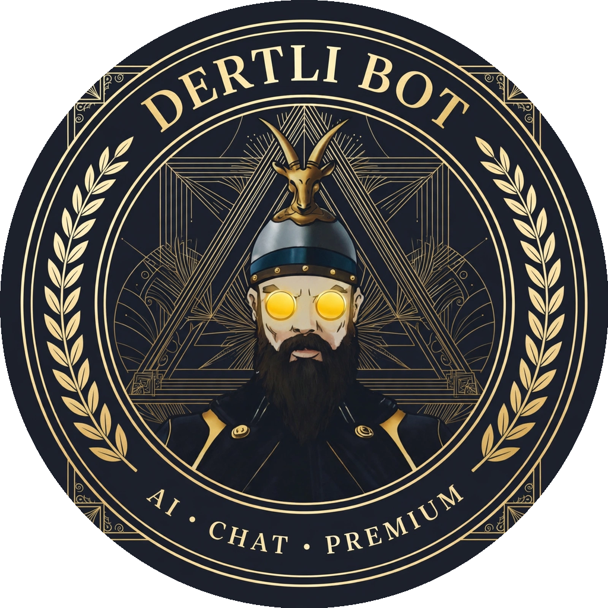
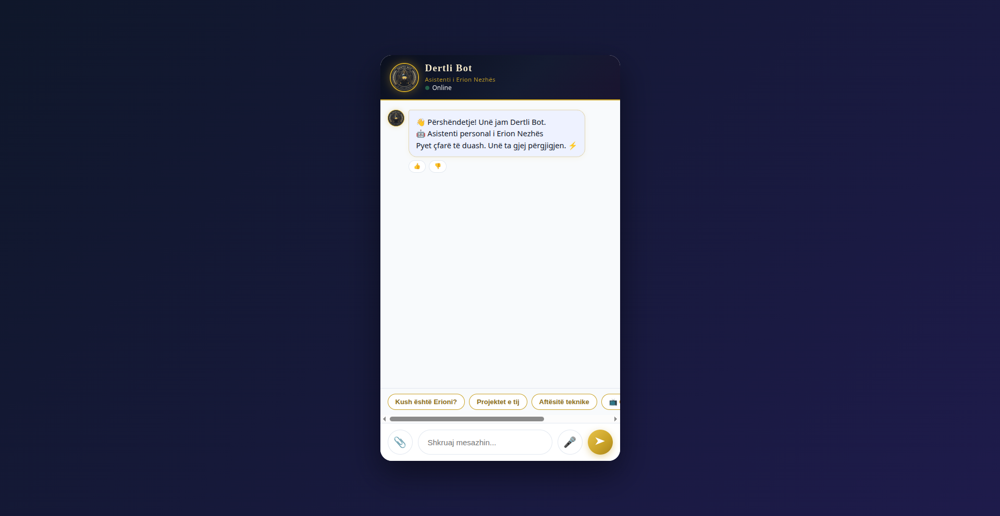

<div align="center">
  

  # 🤖 DERTLI BOT 🇦🇱

  **Asistenti personal AI i Erion Nezhës — flet shqip 🇦🇱**

  [](https://dertlibot.netlify.app)
  [](https://dertlibot.netlify.app)
</div>



---

## ✨ Funksionet

- 💬 **Bisedë në shqip** — përgjigjet natyrshëm në gjuhën shqipe
- ⚡ **AI hibrid** — CodeCraft si primar, me fallback automatik në Gemini kur kreditet mbarojnë
- 👋 **Përshëndetje personale** — mesazh mirëseardhjeje dhe quick-replies
- 👍👎 **Vlerësimi** — përdoruesit vlerësojnë përgjigjet (ruhet lokalisht në browser)
- 🖼️ **Mbështetje imazhesh** — shfaq imazhin e paketave IPTV kur pyetet për çmime
- 🛡️ **Siguri server-side** — çelësat API nuk ekspozohen kurrë në browser; rate limiting 30 kërkesa/orë për IP

## 🛠️ Teknologjitë


## 📁 Struktura

```
├── index.html          # Faqja kryesore
├── style.css           # Stili premium gold-on-dark
├── app.js              # Logjika e bisedës
├── config.js           # Emri, përshëndetja, system prompt
├── logo.png            # Logoja e Dertli Bot
├── iptv-pakot.png      # Imazhi i paketave IPTV
└── netlify/
    └── functions/
        └── chat.js     # Backend-i: AI primar + fallback, siguri, rate limit
```

## 🚀 Live Demo

**https://dertlibot.netlify.app**

## 👨‍💻 Autori

**Erion Nezha** — Software Engineer

- 🌐 Portfolio: https://erionnezha.netlify.app/
- 💼 LinkedIn: https://linkedin.com/in/erion-nezha
- 📸 Instagram: https://instagram.com/erjonixx
- 📧 Email: erjonixx@proton.me

---

## 📄 Licenca

© 2026 Erion Nezha — **All rights reserved.**

Kodi publikohet vetëm për qëllime portofoli. Ndalohet kopjimi, modifikimi apo rishpërndarja pa lejen me shkrim të autorit. Shih skedarin [LICENSE](LICENSE) për detaje.

---

# 🤖 DERTLI BOT 🇬🇧 (English)

**Erion Nezha's personal AI assistant — speaks Albanian 🇦🇱**

[](https://dertlibot.netlify.app)

## ✨ Features

- 💬 **Chat in Albanian** — responds naturally in Albanian
- ⚡ **Hybrid AI** — CodeCraft as primary, automatic fallback to Gemini when credits run out
- 👋 **Personal greeting** — welcome message and quick-replies
- 👍👎 **Ratings** — users rate answers (stored locally in the browser)
- 🖼️ **Image support** — shows the IPTV packages image when asked about prices
- 🛡️ **Server-side security** — API keys never exposed in the browser; rate limiting 30 requests/hour per IP

## 🚀 Live Demo

**https://dertlibot.netlify.app**

## 📄 License

© 2026 Erion Nezha — **All rights reserved.** Published for portfolio purposes only.
